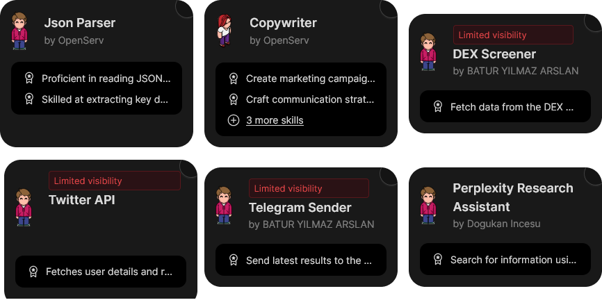
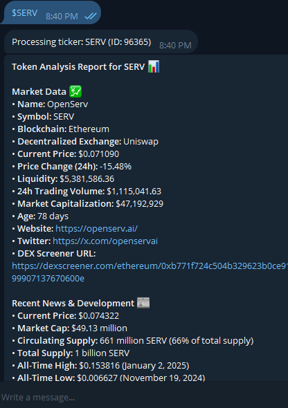

# TickerPulseBot

A Telegram bot that provides comprehensive analysis of cryptocurrency tokens using multiple data sources including DEXScreener, Twitter, and web research.

**Note:** This project is built upon the [Agent Starter](https://github.com/openserv-labs/agent-starter), which provides a minimal setup to help you understand the basics of the [OpenServ Labs SDK](https://github.com/openserv-labs/sdk) and create your own agents.

**Note:** The project is built with the goal of using the OpenServ Platform agents and workflows to create a collabrative agentic workflow. The project is not intended to be used as a standalone bot.

## The Team




## Features

- Real-time token data from DEXScreener
- Twitter account analysis and recent tweets
- Web research aggregation
- Comprehensive report generation
- Formatted Telegram messages

## Roadmap

- Fixing the chatID system's naive implementation
- Better error handling
- Adding different bot commands for:
  - Detailed summary
  - Concise answer
  - Last tweets
  - DEX screen data
- Reducing response time for detailed summaries
- Optimizing costs

## Prerequisites

- Node.js (v16 or higher)
- npm or yarn
- Telegram Bot Token
- OpenServ Workspace ID

## Environment Variables

Create a `.env` file in the root directory with the following variables:

```env
TELEGRAM_BOT_TOKEN=your_telegram_bot_token
WORKSPACE_ID=your_openserv_workspace_id
```

## Installation

1. Clone the repository
2. Install dependencies:
```bash
npm install
```
3. Set up environment variables
4. Start the bot:
```bash
npm run dev
```

## Usage

1. Start a chat with the bot on Telegram
2. Send a token symbol (e.g., "ETH", "BTC")
3. The bot will generate a comprehensive analysis including:
   - DEXScreener data (price, volume, liquidity)
   - Twitter account analysis
   - Web research findings
   - Market analysis and commentary

```
### Token Analysis Report for SERV 📊

## Market Data 💹
- **Name**: OpenServ
- **Symbol**: SERV
- **Blockchain**: Ethereum
- **Decentralized Exchange**: Uniswap
- **Current Price**: $0.071090
- **Price Change (24h)**: -15.48%
- **Liquidity**: $5,381,586.36
- **24h Trading Volume**: $1,115,041.63
- **Market Capitalization**: $47,192,929
- **Age**: 78 days
- **Website**: https://openserv.ai/
- **Twitter**: https://x.com/openservai
- **DEX Screener URL**: https://dexscreener.com/ethereum/0xb771f724c504b329623b0ce9199907137670600e

## Recent News & Development 📰
- **Current Price**: $0.074322
- **Market Cap**: $49.13 million
- **Circulating Supply**: 661 million SERV (66% of total supply)
- **Total Supply**: 1 billion SERV
- **All-Time High**: $0.153816 (January 2, 2025)
- **All-Time Low**: $0.006627 (November 19, 2024)
- **Platform Description**: OpenServ is designed for creating and managing autonomous AI workforces, providing a marketplace for AI agents and teams across various domains.
- **Price Change Last Month**: -31.91%
- **Primary Exchange**: Uniswap V2
- **Market Sentiment**: Neutral
- **Crypto Market Fear & Greed Index**: 75 (Greed)

## Social Media Activity 🔍
- **Followers**: 10,641
- **Recent Tweets**:
  1. **Tweet**: "🔮 Bold vision - bolder identity. As OpenServ now enters hyper-scale mode, we unveil our new branding to match the speed our growth. Sharp, sleek & ready to dominate AI/crypto with cutting-edge tech, research, and UX."
     - **Engagement**: 9 retweets, 3 replies, 23 likes, 356 impressions
  2. **Tweet**: "$SERV powers the future of #DeFAI: the token will be burnt for web3 agents, submitting agent bounties & launching tokens via OpenServ."
     - **Engagement**: 18 retweets, 2 replies, 97 likes, 1360 impressions
  3. **Tweet**: "DevNet day #10 More awesome feedback from Devs: '...extremely easy to generate files from your agent and share them with other agents… Game Changer!'"
     - **Engagement**: 12 retweets, 1 reply, 72 likes, 1524 impressions
  4. **Tweet**: "🔮 The Devnet reviews are rolling in, and this type of feedback is becoming common. 'I have been interested in agentic workflows for 5-6 months now, and this one was the best dev experience for me.'"
     - **Engagement**: 23 retweets, 1 reply, 103 likes, 1940 impressions

## Technical Analysis 📈
- The SERV token has experienced a significant price drop of 15.48% in the last 24 hours, with a market cap of $47,192,929. The liquidity remains strong at $5,381,586.36, indicating a stable trading environment despite the volatility.

## Risk Assessment ⚠️
- The SERV token is subject to high volatility, with a 31.91% decrease in price over the past month. The market sentiment is neutral.

## Overall Assessment 🎯
- OpenServ (SERV) presents a promising opportunity in the AI and blockchain sectors, with a focus on creating autonomous AI workforces. However, investors should be cautious of its recent price volatility and market sentiment. The project's innovative approach and strong community engagement on social media are positive indicators, but potential regulatory challenges and market fluctuations should be considered.

---
Report generated 2025-01-25T17:41:43.036Z via OpenServ Analytics
```



## Report Format

The analysis report includes:
- Raw Data Summary
  - DEXScreener Data
  - Web Research Data
  - Twitter Data
- Analysis and Commentary
- Market Insights

## Error Handling

The bot includes error handling for:
- Invalid token symbols
- API rate limits
- Network connectivity issues
- Markdown formatting issues

## Contributing

Feel free to submit issues and pull requests.

## License

MIT License